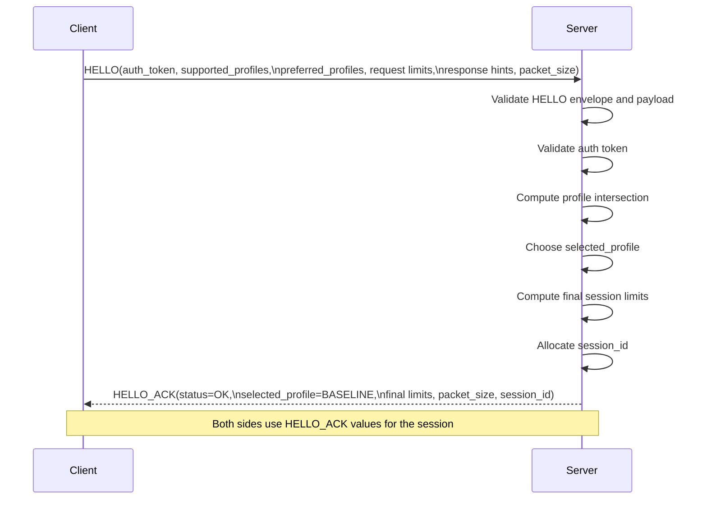
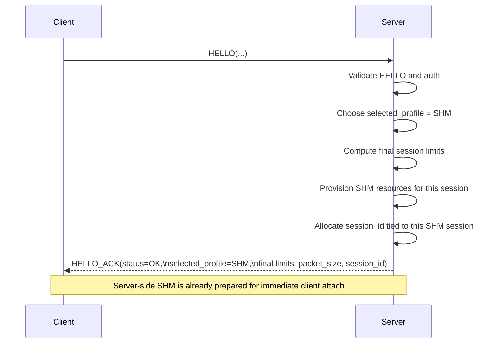
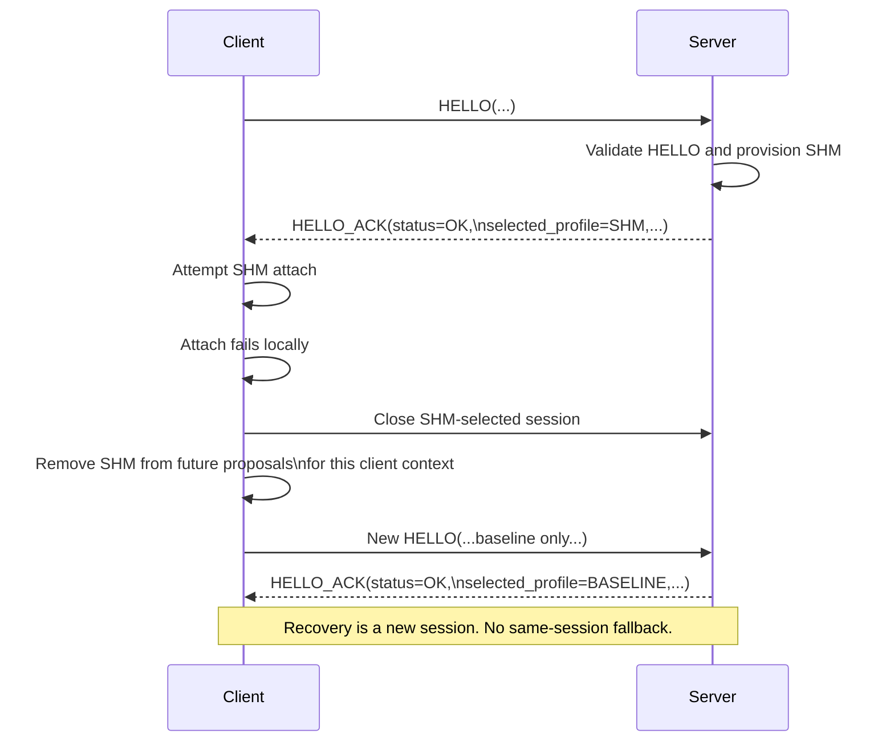
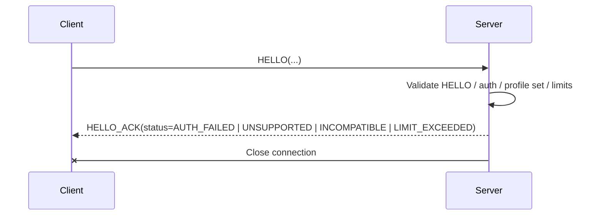

# Level 1: Transport API Specification

## Purpose

Level 1 is the foundation of the plugin-ipc library. It is responsible for
moving opaque byte payloads reliably between peers, without knowing or caring
what those payloads mean.

Everything above Level 1 (typed methods, callbacks, snapshot caching) is built
exclusively on top of it. Level 1 must therefore be complete and self-contained:
any transport, framing, integrity, sequencing, or connection-management concern
that higher levels depend on must be solved here, not deferred upward.

## Scope

Level 1 owns every concern that exists between "the caller has bytes to send"
and "the peer has received those bytes correctly." Specifically:

- Connection lifecycle (connect, listen, accept, close)
- Transport negotiation and profile selection
- Authorization handshake
- Directional limit negotiation
- Message framing (outer envelope, payload boundaries)
- Batch framing (item directory, item payload assembly and extraction)
- Transparent chunking for packet-limited transports
- Request/response correlation by message_id
- Sequencing and out-of-order detection
- Chunk integrity validation
- Protocol failure detection and reporting
- Connection health monitoring and failure propagation
- Native wait-object exposure for caller-owned event loops

Level 1 does NOT own:

- Typed payload encoding or decoding (Codec)
- Response builder mechanics (Codec)
- Callback dispatch or handler registration (Level 2)
- Worker thread management (Level 2 managed server)
- Client context lifecycle or automatic retry/reconnect policy (Level 2)
- Snapshot refresh, caching, or lookup (Level 3)

## Principles

### 1. Payload opacity

Level 1 treats all payloads as opaque byte ranges. It never interprets the
content of a request or response payload. It does not know what method a
message belongs to, what service produced it, or what the bytes mean.

The only structure Level 1 understands is:

- The outer message envelope (fixed 32-byte header)
- The batch item directory (array of offset + length descriptors)
- Chunk continuation headers
- Handshake control payloads

Everything else is opaque to Level 1 and meaningful only to Level 2 and above.

### 2. Async-capable, event-loop friendly

Level 1 must not force a blocking request-then-response programming model on
callers.

- Sending a request must not require waiting for its response.
- Receiving a response must not require having just sent a request.
- Callers must be able to integrate Level 1 sessions into their own event
  loops using native wait objects (file descriptors on POSIX, HANDLEs on
  Windows).

The only blocking that Level 1 may perform is within one logical send
progression or one logical receive progression (e.g., sending all chunks of a
single message). Level 1 must never block across a request-to-response
boundary.

### 3. Pipelining

A client may send multiple independent requests on the same session without
waiting for any response. Multiple logical messages may be in-flight
simultaneously on one connection.

Responses may arrive in any order. The server is not required to respond in
request order. Correlation between requests and responses is exclusively by
message_id.

If a caller needs ordered results for dependent work, it should use batching
(one message, ordered items). Pipelining is for independent work.

### 4. Batching

Batching is a Level 1 framing feature, not a typed-method feature.

A single logical message may carry multiple opaque item payloads. Level 1
provides primitives to:

- Create a batch message
- Add opaque item payloads to it (each item is just a byte range)
- Finalize the batch into one logical message with a single message_id
- On the receive side: determine the item count, extract individual item
  payloads by index

Level 1 knows item_count and the offset+length directory. It does not
interpret item payloads.

Batches are homogeneous by construction: the outer header carries one
`code` field (method id) that applies to all items in the batch. There
is no way to encode a mixed-method batch — the wire format does not
support it. If a service needs to multiplex sub-types, it defines them
inside its own payload format, not in the outer header.

Batch request and batch response items are correlated by array position: item 0
in the response corresponds to item 0 in the request.

A caller may freely choose pipelining, batching, or any combination:

- Pipeline 5 single-item messages (5 message_ids, out-of-order responses)
- Send 1 batch of 50 items (1 message_id, ordered items by position)
- Pipeline 3 batches of different sizes simultaneously

### 5. No chunk interleaving

Each logical message occupies the wire exclusively from its first byte to its
last byte. Chunks from different logical messages must never be interleaved on
the same connection.

This means:

- A chunked send of message A must complete before message B can begin sending
  on the same connection.
- The receiver can always assume that consecutive chunks belong to the same
  logical message.
- Pipelining is achieved by sending complete logical messages one after another,
  not by interleaving their chunks.

### 6. Connection failure is total for the session

If a connection breaks (transport error, peer disconnect, protocol violation),
all in-flight requests on that session fail. Level 1 reports every in-flight
message_id as failed. There is no partial recovery and no silent retry.

Other sessions on the same listener are unaffected. The listener itself is
unaffected.

The decision of whether to reconnect, and what to do with failed requests,
belongs to the caller or to higher-level wrappers (Level 2 / Level 3).

### 7. No automatic retry or reconnect

Level 1 is the transport truth. If a send fails, it fails. If a connection
drops, it drops. Level 1 never silently retries a transmission or reconnects
behind the caller's back.

Retry and reconnect policies are concerns of Level 2 and Level 3, where the
semantics (at-least-once, idempotent methods, cache preservation) are known.

## Service Identity

Level 1 is service-oriented, not plugin-oriented.

- clients connect to `service_namespace + service_name`
- they do not care which plugin/process provides that service
- one listener serves one service endpoint
- one service endpoint serves one request kind only

Examples of service kinds:

- `cgroups-snapshot`
- `ip-to-asn`
- `pid-traffic`

Providers may appear late, restart, or be absent entirely. Level 1 only
implements connect/listen/accept/close for service endpoints. Optional
dependency handling and reconnect cadence belong to Level 2 / Level 3.

## Features

### Connection lifecycle

Level 1 manages the full lifecycle of transport connections:

- **Connect**: establish a session to a service endpoint, identified by
  service_namespace + service_name. The transport path is derived from these
  identifiers (socket path on POSIX, named pipe path on Windows). Connection
  includes the handshake (see below).
- **Listen**: create a transport endpoint for a service and begin accepting
  clients. One listener serves one service endpoint.
- **Accept**: accept incoming client connections on a listener. Each accepted
  connection becomes an independent session after completing the handshake.
  A listener must support multiple concurrent sessions.
- **Close**: tear down a session or a listener. Closing a session releases
  its transport resources. Closing a listener stops accepting new connections
  but does not forcibly terminate existing sessions (that is a higher-level
  policy decision).

### Handshake

Every new session begins with a handshake over the baseline transport. The
handshake is a single request-response exchange using control messages. It
establishes:

- **Authorization**: the client presents a caller-supplied auth token. The
  server verifies it. If verification fails, the session is rejected. The
  library never reads auth tokens from environment variables or files — it
  accepts the token value from the caller.
- **Profile negotiation**: the client advertises its supported transport
  profiles (bitmask) and preferred profiles. The server selects the best
  mutually supported profile from the intersection. If no intersection exists,
  the session is rejected. The handshake itself always happens on the baseline
  transport.
- **Directional limit negotiation**: request and response directions have
  independent size ceilings. The handshake negotiates:
  - max request payload bytes
  - max request batch items
  - max response payload bytes
  - max response batch items
  The exact rule for every field is defined in the wire envelope spec. There
  is no blanket formula for all fields.
- **Packet size negotiation**: the client advertises its transport packet size.
  The server responds with the negotiated packet size (minimum of client and
  server). Both sides use this single negotiated packet size for chunking on
  the connection. The negotiated packet size must be strictly greater than the
  header size (32 bytes); if it is not, the server rejects the handshake.

### Handshake strategy

The handshake is a proposal/result protocol:

- the client sends one `HELLO`
- the server validates it, decides all final session values, and sends one
  `HELLO_ACK`
- the client must operate from the values returned in `HELLO_ACK`, not from
  the raw values it originally proposed

Successful handshake means:

- `transport_status = OK`
- the selected transport profile is final and locked for the session
- all returned limits are final for the session
- if the selected profile is SHM, the server has already prepared the SHM
  resources for that session
- if the client still cannot attach the negotiated SHM transport locally, it
  must close that session and recover only via a new handshake without SHM

Rejected handshake means:

- the server sends `HELLO_ACK` with a non-`OK` `transport_status`
- the server closes the connection after sending the rejection
- the client learns the rejection class from `transport_status`

The normative field-by-field decision matrix lives in
`docs/level1-wire-envelope.md`.

### Handshake sequence diagrams

#### Successful baseline handshake

#### Successful SHM handshake

#### Client-side SHM attach failure recovery

#### Rejected handshake

### Message framing

Every message on the wire begins with a fixed 32-byte outer header:

- magic and version for framing validation
- kind: control, request, or response
- flags: at least batch
- code: method id (for request/response) or control opcode
- transport_status: envelope-level status only, never business outcomes
- payload_len: total bytes after the header
- item_count: 1 for single messages, N for batches
- message_id: request/response correlation identifier

For single messages (item_count = 1), the payload follows the header directly.

For batch messages (item_count > 1), the payload begins with the item
directory (an array of item_count offset + length descriptors), followed by
the packed item payloads. Offsets are relative to the start of the packed
item payload area.

Level 1 validates the outer header on every received message:

- magic and version must match expected values
- header_len must be consistent
- payload_len must not exceed the negotiated directional limit
- item_count must not exceed the negotiated directional batch item limit
- for batch messages, the item directory must be internally consistent
  (offsets and lengths must not exceed payload boundaries, must not overlap
  where the schema forbids it)

### Batch assembly and extraction

Level 1 provides primitives for working with batch messages:

- **Assembly** (sender side):
  - Create a batch context for a given message
  - Add opaque item payloads one at a time (each is a byte range)
  - The library manages the item directory (offset + length bookkeeping),
    alignment, and padding
  - Finalize the batch into one complete logical message ready for sending

- **Extraction** (receiver side):
  - Given a received batch message, determine the item_count
  - Extract individual item payloads by index (returns a pointer/slice to the
    item's byte range within the received message buffer)
  - Items are accessed by position, not copied — extraction is zero-copy

### Transparent chunking

Baseline transports may have a maximum packet size smaller than the logical
message size. Level 1 handles this transparently:

- **Sender**: if a message exceeds the negotiated packet size, the sender
  splits it into consecutive chunks. The first chunk carries the full outer
  header. Continuation chunks carry a small chunk header that includes enough
  metadata to detect wrong packet order, wrong message identity, and
  accidental desync. The sender reuses offsets over the original message
  buffer — no copying or splitting of the payload data. The send blocks until
  all chunks of the single logical message are transmitted.

- **Receiver**: reads the first chunk and its outer header. Allocates the full
  logical message buffer once from the metadata in the first chunk. Receives
  remaining chunks immediately, appending by offset. Validates each
  continuation chunk header against expected sequence and message identity.

- **No multiplexing**: during one chunked send or receive operation, the
  connection carries only chunks from that single logical message.

- **Mid-stream failure**: if any chunk fails to send or receive, the behavior
  is identical to any other transport failure: discard partial data, report
  the session as broken. There is no partial-message recovery.

### Sequencing and correlation

- Every request message carries a message_id assigned by the client.
- Every response message carries the message_id of the request it answers.
- Level 1 tracks in-flight message_ids on the client side.
- When a response arrives, Level 1 matches it to the originating request by
  message_id and delivers it to the caller.

Out-of-order detection:

- If a response arrives with a message_id that is not in the in-flight set
  (unknown or already completed), Level 1 treats it as a protocol violation.
- If a duplicate message_id is detected in the in-flight set during request
  submission, Level 1 rejects the submission.

### Protocol failure detection

Level 1 detects and reports protocol-level failures including:

- Malformed outer headers (bad magic, unknown version, inconsistent lengths)
- Payload size exceeding negotiated directional limits
- Batch item count exceeding negotiated directional limits
- Inconsistent batch item directory (offsets/lengths out of bounds)
- Chunk continuation header mismatches (wrong sequence, wrong message)
- Unexpected message kinds (e.g., a request on the client-side receive path)
- Handshake failures (auth rejection, profile mismatch, limit mismatch)

All protocol failures result in session termination. Level 1 does not attempt
to recover from protocol violations — a violation means the peer is broken or
the connection is corrupted, and continuing would be unsafe.

### Connection health

Level 1 monitors connection health at the transport level:

- Detects transport-level disconnects (peer closed, broken pipe, connection
  reset)
- On disconnect, reports all in-flight message_ids as failed
- Distinguishes between graceful peer disconnect and transport errors where
  possible (e.g., io.EOF vs connection reset)

### Native wait-object exposure

Level 1 exposes native OS wait objects so callers can integrate sessions and
listeners into their own event loops:

- POSIX: file descriptor (fd)
- Windows: HANDLE

Wait objects are available for:

- Listener accept-readiness (new client connection available)
- Session read-readiness (response or request data available)

This allows callers to multiplex many sessions and listeners in a single
event loop without dedicating a thread per connection.

## Transport backends

Level 1 supports multiple transport backends behind the same API surface:

### Baseline transports

| Transport | Platform | Characteristics |
|-----------|----------|-----------------|
| UDS SEQPACKET | Linux, FreeBSD, macOS | Message-oriented, packet-limited, always available |
| Named Pipe | Windows | Message-oriented, always available |

Baseline transports are always available and require no negotiation beyond
the standard handshake. They support full pipelining (many in-flight messages).
They may require chunking for large messages.

### SHM transports

| Transport | Platform | Synchronization |
|-----------|----------|-----------------|
| SHM | Linux | Futex-based |
| SHM | Windows | WaitOnAddress / named events |

SHM transports are negotiated upgrades from the corresponding baseline
transport. The handshake always occurs on the baseline transport. If both
peers support an SHM profile, the data plane switches to shared memory after
the handshake completes.

SHM transports use a unified control/data model:

- One shared control header
- One client-owned variable-length request publication area
- One server-owned variable-length response publication area

The SHM data areas carry the same outer protocol envelope as baseline
transports. Level 2 and above see no difference between baseline and SHM.

Current SHM implementation supports one in-flight publication per direction.
This means SHM does not support pipelining in its current form — only one
request can be outstanding before its response is consumed. This is an
implementation constraint of the current SHM layout, not a protocol
prohibition. Callers that need pipelining over SHM should pipeline at the
batch level (one batch message in flight containing multiple items) or fall
back to the baseline transport.

FreeBSD and macOS do not have SHM backends. They always use the baseline UDS
transport.

### Transport selection

Transport selection is automatic and transparent to higher levels:

1. Both peers advertise supported profiles during handshake
2. The server selects the best mutually supported profile
3. If SHM is selected, the data plane upgrades after handshake
4. All subsequent Level 1 operations work identically regardless of the
   active transport backend

Callers configure which profiles they support and prefer. They do not
manually select a transport for each message.

## Multi-client server support

Level 1 servers must support multiple concurrent clients. This is a
mandatory capability, not an optional enhancement.

- A listener accepts any number of client connections.
- Each connection is an independent session with its own handshake state,
  negotiated limits, and transport backend.
- Sessions do not interfere with each other. A failure on one session does
  not affect other sessions or the listener.
- Level 1 provides the session primitives. How sessions are serviced
  (dedicated threads, thread pool, event loop) is the caller's decision at
  Level 1. Level 2 managed server mode provides an opinionated threading
  model on top.

## Stale endpoint recovery

Service endpoints (socket files, named pipe names, SHM regions) may become
stale if a server process crashes without cleanup. Level 1 handles this:

- On listen: if a stale endpoint exists from a dead process, Level 1 reclaims
  it (unlinks and recreates).
- On listen: if an active endpoint exists from a live process, Level 1 fails
  with an appropriate error (address already in use).
- On POSIX: automatic stale unlink is allowed only when `run_dir` is owned by
  the effective process user and is not group- or world-writable. In unsafe
  shared directories, stale entries are treated as in-use so Level 1 does not
  unlink paths that another local user could race or replace.
- Stale detection uses process ownership metadata (PID and generation) to
  avoid false reclamation due to PID reuse.

## Testing requirements

Level 1 must have:

- **High test coverage** (90%+ enforced): every code path, every branch, in all languages
  and on all supported platforms.
- **Fuzz testing**: all parsing and validation code (outer header decode,
  chunk header decode, batch item directory decode, handshake payload decode)
  must be exercised by fuzz tests that feed arbitrary byte sequences.
- **Abnormal path coverage**: explicit tests for every failure mode listed
  in this specification, including:
  - Malformed headers
  - Oversized payloads
  - Corrupt chunk sequences
  - Auth failures, individually
  - Profile mismatches
  - Mid-stream disconnects
  - Stale endpoint recovery
  - Duplicate and unknown message_ids
  - Concurrent multi-client sessions
  - Pipelining correctness with out-of-order responses
  - Batch assembly and extraction edge cases (0 items, 1 item, max items,
    items at the directional size limit)
- **Handshake compliance coverage**: every negotiated handshake field must be
  tested individually against the documented contract in all implementations,
  including:
  - authorization success/failure
  - profile intersection and selection
  - request payload acceptance and `> 1 MiB` rejection
  - request/response batch-item symmetry
  - response payload authority
  - packet-size negotiation
  - `session_id` allocation
- **Profile guarantee coverage**: if handshake succeeds with an SHM profile,
  tests must prove that the server prepared SHM before success and that any
  client-side attach failure closes that session and reconnects without SHM.
  No same-session fallback is allowed.

No exceptions. Nothing is acceptable for Netdata integration unless Level 1
can demonstrate that malformed IPC, corner cases, and abnormal situations
cannot crash the process.
